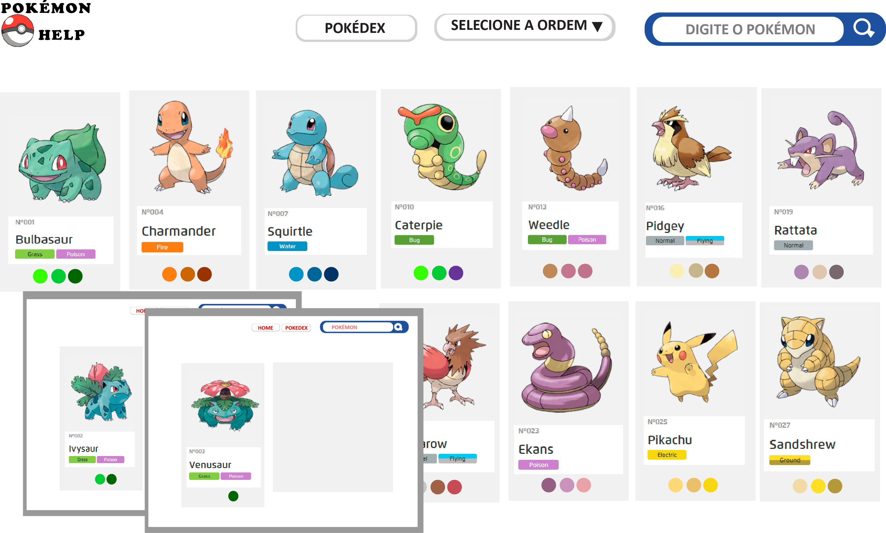
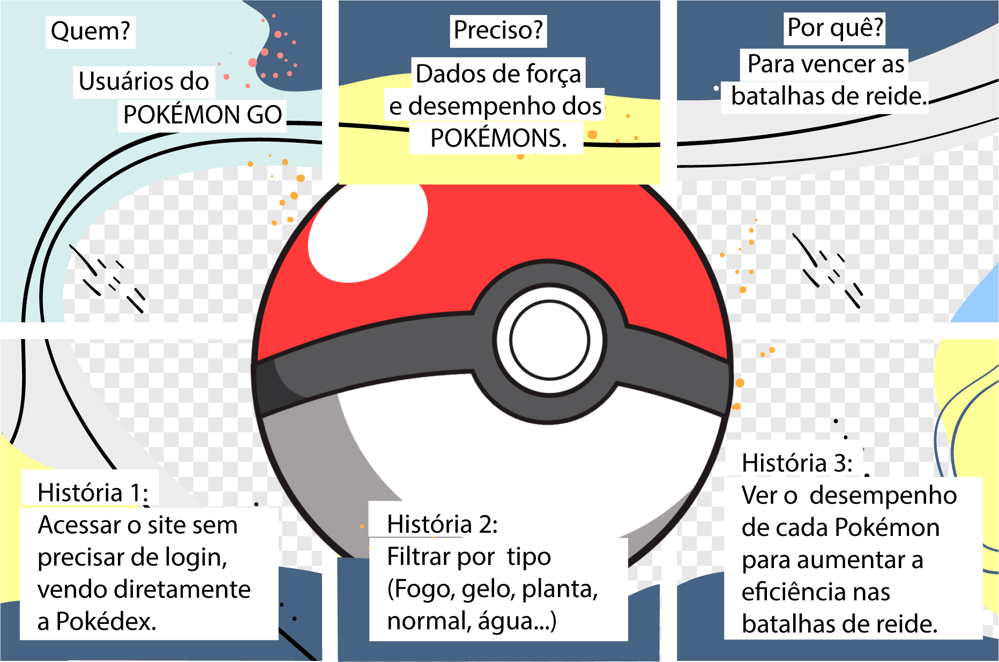

# Data Lovers POKÉMON

Este projeto referênte à Pokémon Go foi desenvolvido no curso da Laboratoria, pelas alunas JessicaCavalcante e TanagraAndria.

Pokémon GO é um game grátis de realidade aumentada para Android e iPhone (iOS), 
que permite ao jogador viver uma aventura real, usando o mapa do mundo onde vivemos, 
para caçar e capturar Pokémon ao longo do caminho.

Com o objetivo de auxiliar os usuários do Pokémon Go, em suas missões de reides,
desenvolvemos o POKÉMON HELP. O site possuí dados dos principais Pokémons da região
Kanto, apresentando suas principais características como força, tipo  e eficiência
em batalhas. 

Para o desenvolvimento do projeto, realizamos pesquisas com os usuários do jogo,
coletando as principais necessidades de dados para auxiliar em um maior desempenho
e agilidade nas missões do jogo.

Para acessá-lo clique em um dos links abaixo:

`<link>` : < https://jessicacavalcante.github.io/SAP005-data-lovers/>

`<link>` : < https://tanagraandria.github.io/SAP005-data-lovers/>

* [1. Ferramentas utilizadas](#3-ferramentas utilizadas)
* [2. Histórias de usuário](#4-histórias de usuário)
* [3. Protótipo de baixa fidelidade](#5-protótipo de baixa fidelidade)
* [4. Lista de problemas detectados nos testes de usabilidade](#6-problemas detectados nos testes de usabilidade)

***

## 1. Ferramentas utilizadas

* HTML 
* CSS
* DOM
* JavaScript
* Jest 

## 2. Protótipo de baixa fidelidade

* O protótipo de baixa fidelidade  desenvolvido a lápis:

* Protótipo de baixa fidelidade foi desenvolvido utilizando o software adobe illustraitor:

* Círculo de cores

## 3. Histórias de usuário

### Definição do produto

Após uma pesquisa com os usuários do jogo Pokémon GO, constatamos a necessidade de criar um site contendo informações para auxiliar os usuários no desempenho das batalhas e desafios do jogo. 

Sendo assim desenvolvemos o Pokémon Help, nele o usuário encontra uma página inicial contendo uma pokedex completa com os pokémons das regiões kanto e johto,  filtros de busca por nome e  tipo. 

A segunda página, a Poke Info, é ativada no card de cada pokémon, nela é apresentado mais detalhes referente ao pokémon escolhido, como tipo, fraquezas, resistência, km egg, e estatísticas com  um cálculo agregado apresentando qual o maior e menor ataque de cada pokémon.

### Histórias de usuário

## 4. Lista de problemas detectados nos testes de usabilidade

#### Testes de usabilidade

No teste de usabilidade com usuários pokémon go constatamos:
* Na página principal havia um menu sem usabilidade, então o retiramos.

* No botão Poke Info e no menu pokédex para retornar a página principal estavam sem destaque. Para solucionar adicionamos uma cor diferente no botão ao passar o mouse.

